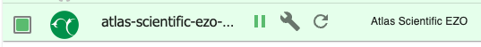
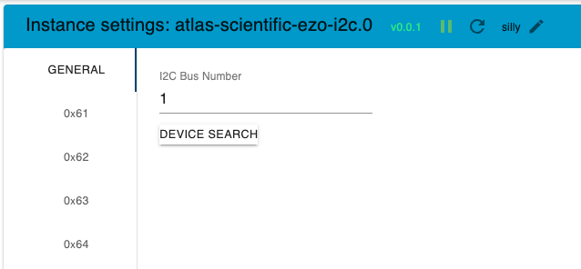
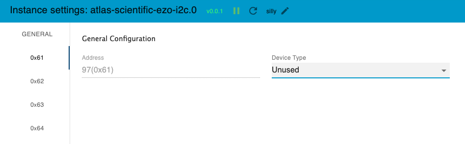
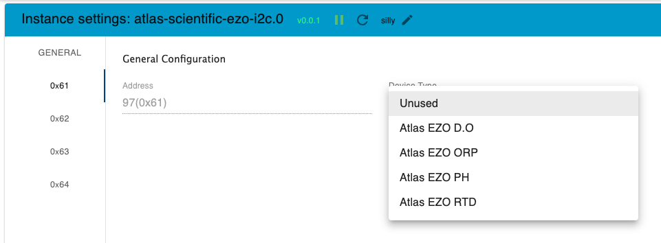
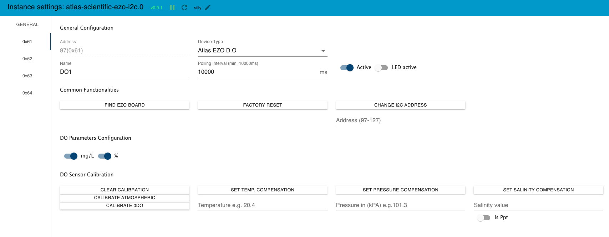
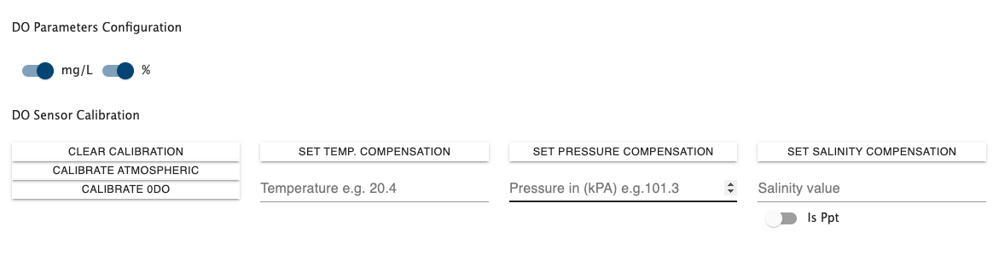
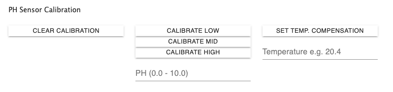
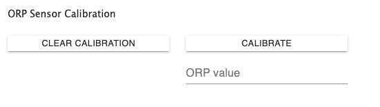
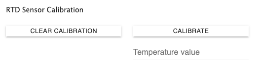

# ioBroker.atlas-scientific-ezo-i2c

**Tests:** 

### If you like it, please continue reading ... and donate my efforts

I am happy about every single person I can help to integrate these great Atlas Scientific Sensors into their own home, and I hope you can imagine how much time and effort such an adapter development entails.. That said, I'm very thankful about your donation in Paypal if it is useful for you..

## Atlas Scientific EZO I2C Adapter for ioBroker

This ioBroker Adapter integrates several Atlas Scientific EZO Devices https://atlas-scientific.com/ into your own ioBroker environment. The EZO devices have to be configured for I2C Bus and have to be mounted on a device (e.g. RaspberryPi..) with configured and enabled I2C Bus.

Currently Supported Devices

-   EZO DO - Dissolved Oxygen -> https://atlas-scientific.com/dissolved-oxygen
-   EZO ORP - Oxidation-reduction potential -> https://atlas-scientific.com/orp
-   EZO pH - Potential of Hydrogen -> https://atlas-scientific.com/ph
-   EZO RTD - Resistance Temperature Detector -> https://atlas-scientific.com/temperature

Future Support

-   EZO PMP - Embedded Peristaltic Dosing Pump -> https://atlas-scientific.com/peristaltic/ezo-pmp/
-   EZO EC - Electrical conductivity -> https://atlas-scientific.com/conductivity

## Getting started

## Install

Especially make sure, that you have properly configured and enabled I2C on your system (if needed):

-   [Configuring I2C on the Raspberry Pi](https://github.com/fivdi/i2c-bus/blob/master/doc/raspberry-pi-i2c.md)

### Setup Adapter

After the Adapter installation and the preconfigured RaspberryPi you will find the new Adapter in the Instaces Section where you can further configure your sensors.

With a click on the wrench icon a new settings window will appear pre selected with the "General" Settings Tab.

Here you have to insert the I2C Number into the Textfield which was configured on the Raspberry Pi (0 or 1). Afterwards you can then press the "Device Search"-Button to search for all connected EZO circuits. The found device-addresses will be listed on the left hand side.

With a click on one of the found devices the unconfigured device screen appears.

Click the dropdown menu to select the type of your selected device.

After you`ve selected the type of device the settings for the desired device appear. Repeat those steps for each device you wanna use.

## General Configuration (all devices)

-   **Address:** Non adjustable (except change of IP Address)
-   **Device Type:** Desired Device Type Dropdown
-   **Name:** Name of the Device stored on the device later on (Whitespace will be removed. If longer than 16 characters, only the first 16 will be sent.)
-   **Polling Interval:** Interval in milliseconds for the device value polling. If > 0 the device will be reading all values in this intervall. Please increase the intervall time when you will receive wrong readings. I suggest at least to start with 15000ms
-   **Active Switch:** Switch to enable or disable the use of that sensor
-   **LED Active Switch:** With this setting you can enable or disable the LED on the EZO Device

## Common Functionalities (all devices)

-   **"Find EZO Board"-Button** -> With a click on this button the LED on the EZO Board starts flashing fast.
-   **"Factory Reset"-Button** -> Execute a factory reset for that device
-   **"Change I2C Address"-Button** -> Here you can program a new I2C Address for that adapter. Please make sure you save the config afterwards.

## Device related settings & functionalities

### DO-Related funtionalities & Settings

**"Clear Calibration"-Button** -> Delete calibration Data  
**"Calibrate Atmospheric"-Button** -> calibrate to atmospheric oxygen levels  
**"Calibrate 0DO"-Button** -> calibrate device to 0 dissolved oxygen  
**"Set Temp. Compensation"-Button** -> set the temperature compensation with the desired value inside the textfield e.g. 20.4  
**"Set Pressure Compensation"-Button** -> set the pressure compensation with the desired value in kPA inside the textfield e.g. 101.3  
**"Set Salinity Compensation"-Button** -> set the salinity compensation with the desired value inside the textfield e.g. 50000 us  
**"isPpt"-Switch** -> Switch to define if Salinity value read/set in ppt instead of us

**States with includes State change detection**
Some states have an state change detection mechanism running which gives the possibility that some compensation values can be set not only by the UI but additionally with changes directly to the states value from outside. This can be useful for example if you want to use comepsation values from a sensor like temperature to adjust the temperature compensation value on the PH Sensor.

For DO Sensor following states are listening for changes: 
"Temperature_compensation"
"Salinity_compensation"
"Pressure_compensation"

### pH-Related funtionalities & Settings

**"Clear Calibration"-Button** -> Delete calibration Data  
**"Calibrate Low"-Button** -> execute the low value calibration (usually 4.0 )  
**"Calibrate Mid"-Button** -> execute the mid value calibration (usually 7.0 )  
**"Calibrate High"-Button** -> execute the high value calibration (usually 10.0 )  
**"Set Temp. Compensation"-Button** -> set the temperature compensation with the desired value inside the textfield e.g. 20.4

**States with includes State change detection**
Some states have an state change detection mechanism running which gives the possibility that some compensation values can be set not only by the UI but additionally with changes directly to the states value from outside. This can be useful for example if you want to use comepsation values from a sensor like temperature to adjust the temperature compensation value on the PH Sensor.

For pH Sensor following states are listening for changes: 
"Temperature_compensation"

### ORP-Related funtionalities & Settings

**"Clear Calibration"-Button** -> Delete calibration Data  
**"Calibrate"-Button** -> calibrate to desired value

### RTD-Related funtionalities & Settings

**"Clear Calibration"-Button** -> Delete calibration Data  
**"Calibrate"-Button** -> calibrate to desired value

### DISCLAIMER

Please make sure that you consider copyrights and trademarks when you use names or logos of a company and add a disclaimer to your README.
You can check other adapters for examples or ask in the developer community. Using a name or logo of a company without permission may cause legal problems for you.

## Changelog

<!--
    Placeholder for the next version (at the beginning of the line):
    ### **WORK IN PROGRESS**
-->

### **WORK IN PROGRESS**
- implemented delay after each polling cycle to decouple memory race conditions on device for I2C
- First steps in base implementation for peristaltic pump
- added translations for new values

### 1.2.2 (2023-06-19)
- Removed forbidden characters from sensor state objects
- added state roles where possible 
- added state units where senseful
- adjusted Readme according changes

### 1.2.1 (2023-06-16)
- Extended Help with Statechangelisteners

### 1.2.0 (2023-06-16)
- Code cleanup
- Exchanged standard setTimeOut / clearTimeout calls with adapter wrapper methods
- Removed "later" function in index.ts and used Delay Class instead

### 1.1.0 (2023-06-08)

- Removed Developer Info
- Extended Test Matrix to [16.x, 18.x, 20.x]
- Patched Translations
- Removed Whitespaces for all States from Sensors and exchanged with underscores

### 1.0.0 (2023-06-06)
- further bugfixes
- patched release yml file
- added  releaseconfig.json

### 0.0.3 (2023-05-09)
bugfixes

### 0.0.2 (2023-05-09)
-   (Buzze11) initial release

### 0.0.1 (2023-05-09)

### DISCLAIMER

Please make sure that you consider copyrights and trademarks when you use names or logos of a company and add a disclaimer to your README.
You can check other adapters for examples or ask in the developer community. Using a name or logo of a company without permission may cause legal problems for you.

## License

                                 Apache License
                           Version 2.0, January 2004
                        http://www.apache.org/licenses/

TERMS AND CONDITIONS FOR USE, REPRODUCTION, AND DISTRIBUTION

1. Definitions.

    "License" shall mean the terms and conditions for use, reproduction,
    and distribution as defined by Sections 1 through 9 of this document.

    "Licensor" shall mean the copyright owner or entity authorized by
    the copyright owner that is granting the License.

    "Legal Entity" shall mean the union of the acting entity and all
    other entities that control, are controlled by, or are under common
    control with that entity. For the purposes of this definition,
    "control" means (i) the power, direct or indirect, to cause the
    direction or management of such entity, whether by contract or
    otherwise, or (ii) ownership of fifty percent (50%) or more of the
    outstanding shares, or (iii) beneficial ownership of such entity.

    "You" (or "Your") shall mean an individual or Legal Entity
    exercising permissions granted by this License.

    "Source" form shall mean the preferred form for making modifications,
    including but not limited to software source code, documentation
    source, and configuration files.

    "Object" form shall mean any form resulting from mechanical
    transformation or translation of a Source form, including but
    not limited to compiled object code, generated documentation,
    and conversions to other media types.

    "Work" shall mean the work of authorship, whether in Source or
    Object form, made available under the License, as indicated by a
    copyright notice that is included in or attached to the work
    (an example is provided in the Appendix below).

    "Derivative Works" shall mean any work, whether in Source or Object
    form, that is based on (or derived from) the Work and for which the
    editorial revisions, annotations, elaborations, or other modifications
    represent, as a whole, an original work of authorship. For the purposes
    of this License, Derivative Works shall not include works that remain
    separable from, or merely link (or bind by name) to the interfaces of,
    the Work and Derivative Works thereof.

    "Contribution" shall mean any work of authorship, including
    the original version of the Work and any modifications or additions
    to that Work or Derivative Works thereof, that is intentionally
    submitted to Licensor for inclusion in the Work by the copyright owner
    or by an individual or Legal Entity authorized to submit on behalf of
    the copyright owner. For the purposes of this definition, "submitted"
    means any form of electronic, verbal, or written communication sent
    to the Licensor or its representatives, including but not limited to
    communication on electronic mailing lists, source code control systems,
    and issue tracking systems that are managed by, or on behalf of, the
    Licensor for the purpose of discussing and improving the Work, but
    excluding communication that is conspicuously marked or otherwise
    designated in writing by the copyright owner as "Not a Contribution."

    "Contributor" shall mean Licensor and any individual or Legal Entity
    on behalf of whom a Contribution has been received by Licensor and
    subsequently incorporated within the Work.

2. Grant of Copyright License. Subject to the terms and conditions of
   this License, each Contributor hereby grants to You a perpetual,
   worldwide, non-exclusive, no-charge, royalty-free, irrevocable
   copyright license to reproduce, prepare Derivative Works of,
   publicly display, publicly perform, sublicense, and distribute the
   Work and such Derivative Works in Source or Object form.

3. Grant of Patent License. Subject to the terms and conditions of
   this License, each Contributor hereby grants to You a perpetual,
   worldwide, non-exclusive, no-charge, royalty-free, irrevocable
   (except as stated in this section) patent license to make, have made,
   use, offer to sell, sell, import, and otherwise transfer the Work,
   where such license applies only to those patent claims licensable
   by such Contributor that are necessarily infringed by their
   Contribution(s) alone or by combination of their Contribution(s)
   with the Work to which such Contribution(s) was submitted. If You
   institute patent litigation against any entity (including a
   cross-claim or counterclaim in a lawsuit) alleging that the Work
   or a Contribution incorporated within the Work constitutes direct
   or contributory patent infringement, then any patent licenses
   granted to You under this License for that Work shall terminate
   as of the date such litigation is filed.

4. Redistribution. You may reproduce and distribute copies of the
   Work or Derivative Works thereof in any medium, with or without
   modifications, and in Source or Object form, provided that You
   meet the following conditions:

    (a) You must give any other recipients of the Work or
    Derivative Works a copy of this License; and

    (b) You must cause any modified files to carry prominent notices
    stating that You changed the files; and

    (c) You must retain, in the Source form of any Derivative Works
    that You distribute, all copyright, patent, trademark, and
    attribution notices from the Source form of the Work,
    excluding those notices that do not pertain to any part of
    the Derivative Works; and

    (d) If the Work includes a "NOTICE" text file as part of its
    distribution, then any Derivative Works that You distribute must
    include a readable copy of the attribution notices contained
    within such NOTICE file, excluding those notices that do not
    pertain to any part of the Derivative Works, in at least one
    of the following places: within a NOTICE text file distributed
    as part of the Derivative Works; within the Source form or
    documentation, if provided along with the Derivative Works; or,
    within a display generated by the Derivative Works, if and
    wherever such third-party notices normally appear. The contents
    of the NOTICE file are for informational purposes only and
    do not modify the License. You may add Your own attribution
    notices within Derivative Works that You distribute, alongside
    or as an addendum to the NOTICE text from the Work, provided
    that such additional attribution notices cannot be construed
    as modifying the License.

    You may add Your own copyright statement to Your modifications and
    may provide additional or different license terms and conditions
    for use, reproduction, or distribution of Your modifications, or
    for any such Derivative Works as a whole, provided Your use,
    reproduction, and distribution of the Work otherwise complies with
    the conditions stated in this License.

5. Submission of Contributions. Unless You explicitly state otherwise,
   any Contribution intentionally submitted for inclusion in the Work
   by You to the Licensor shall be under the terms and conditions of
   this License, without any additional terms or conditions.
   Notwithstanding the above, nothing herein shall supersede or modify
   the terms of any separate license agreement you may have executed
   with Licensor regarding such Contributions.

6. Trademarks. This License does not grant permission to use the trade
   names, trademarks, service marks, or product names of the Licensor,
   except as required for reasonable and customary use in describing the
   origin of the Work and reproducing the content of the NOTICE file.

7. Disclaimer of Warranty. Unless required by applicable law or
   agreed to in writing, Licensor provides the Work (and each
   Contributor provides its Contributions) on an "AS IS" BASIS,
   WITHOUT WARRANTIES OR CONDITIONS OF ANY KIND, either express or
   implied, including, without limitation, any warranties or conditions
   of TITLE, NON-INFRINGEMENT, MERCHANTABILITY, or FITNESS FOR A
   PARTICULAR PURPOSE. You are solely responsible for determining the
   appropriateness of using or redistributing the Work and assume any
   risks associated with Your exercise of permissions under this License.

8. Limitation of Liability. In no event and under no legal theory,
   whether in tort (including negligence), contract, or otherwise,
   unless required by applicable law (such as deliberate and grossly
   negligent acts) or agreed to in writing, shall any Contributor be
   liable to You for damages, including any direct, indirect, special,
   incidental, or consequential damages of any character arising as a
   result of this License or out of the use or inability to use the
   Work (including but not limited to damages for loss of goodwill,
   work stoppage, computer failure or malfunction, or any and all
   other commercial damages or losses), even if such Contributor
   has been advised of the possibility of such damages.

9. Accepting Warranty or Additional Liability. While redistributing
   the Work or Derivative Works thereof, You may choose to offer,
   and charge a fee for, acceptance of support, warranty, indemnity,
   or other liability obligations and/or rights consistent with this
   License. However, in accepting such obligations, You may act only
   on Your own behalf and on Your sole responsibility, not on behalf
   of any other Contributor, and only if You agree to indemnify,
   defend, and hold each Contributor harmless for any liability
   incurred by, or claims asserted against, such Contributor by reason
   of your accepting any such warranty or additional liability.

END OF TERMS AND CONDITIONS

APPENDIX: How to apply the Apache License to your work.

      To apply the Apache License to your work, attach the following
      boilerplate notice, with the fields enclosed by brackets "[]"
      replaced with your own identifying information. (Don't include
      the brackets!)  The text should be enclosed in the appropriate
      comment syntax for the file format. We also recommend that a
      file or class name and description of purpose be included on the
      same "printed page" as the copyright notice for easier
      identification within third-party archives.

Copyright 2023 Buzze11

Licensed under the Apache License, Version 2.0 (the "License");
you may not use this file except in compliance with the License.
You may obtain a copy of the License at

       http://www.apache.org/licenses/LICENSE-2.0

Unless required by applicable law or agreed to in writing, software
distributed under the License is distributed on an "AS IS" BASIS,
WITHOUT WARRANTIES OR CONDITIONS OF ANY KIND, either express or implied.
See the License for the specific language governing permissions and
limitations under the License.

## Third Party Licenses

Some small parts of this project are based on ioBroker.i2c fro UncleSamSwiss https://github.com/UncleSamSwiss/ioBroker.i2c

Copyright 2021 UncleSamSwiss

Licensed under the Apache License, Version 2.0 (the "License"); you may not use this file except in compliance with the License. You may obtain a copy of the License at

http://www.apache.org/licenses/LICENSE-2.0

Unless required by applicable law or agreed to in writing, software distributed under the License is distributed on an "AS IS" BASIS, WITHOUT WARRANTIES OR CONDITIONS OF ANY KIND, either express or implied.

See the License for the specific language governing permissions and limitations under the License.
